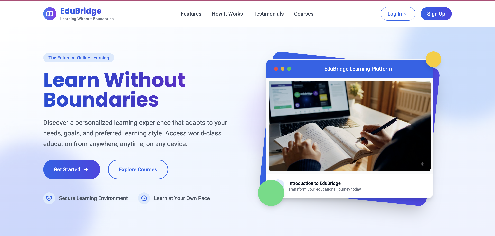

# EduBridge

EduBridge is a full-stack learning management platform designed to connect students, teachers, and administrators in one centralized learning environment. The platform supports course discovery, enrollment, progress tracking, teacher course management, and admin verification workflows.

This repository is a portfolio copy of a collaborative academic project.

## My Contributions

As the principal developer of the EduBridge team, I contributed to:

- Built and refined full-stack features using React, Node.js, Express, and MongoDB
- Developed student-facing learning workflows, including course browsing, enrollment, dashboards, and progress tracking
- Helped implement role-based user experiences for students, teachers, and administrators
- Integrated frontend components with backend API routes
- Improved UI structure, page flow, and responsive design using React and Tailwind CSS
- Participated in debugging, testing, and preparing the project for demo presentation

## Screenshots

### Homepage



### Platform Features


## Tech Stack

**Frontend**
- React
- Tailwind CSS
- React Router
- Axios

**Backend**
- Node.js
- Express
- MongoDB
- Mongoose
- JWT authentication
- Bcrypt.js

## Key Features

### Student Experience
- Course browsing and enrollment
- Personalized dashboard
- Learning goals
- Study session tracking
- Course progress tracking
- Course ratings and reviews

### Teacher Experience
- Teacher profile management
- Course creation and editing
- Course publishing controls
- Student enrollment visibility
- Course performance dashboard

### Admin Experience
- Teacher verification workflow
- User management
- Admin dashboard
- Role-based access control

## Project Structure

```text
EduBridge/
├── client/          # React frontend
├── server/          # Node.js / Express backend
├── README.md
└── package.json